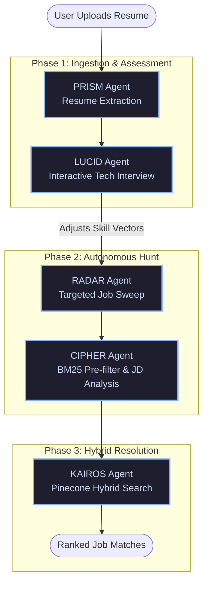

<div align="center">
  
# 🌌 SAMAS
https://samas-pi.vercel.app/

An Autonomous AI Multi-Agent Pipeline that optimizes the job search process by understanding your technical profile, assessing your skills through an interactive AI interview, and autonomously hunting, filtering, and hybrid-matching you with targeted jobs.

[](https://fastapi.tiangolo.com/)
[](https://nextjs.org/)
[](https://langchain.com/)
[](https://www.pinecone.io/)
[](https://smith.langchain.com/)

</div>

---

## 🚀 Overview

**SAMAS** is a multi-agent LLM orchestration system built with **LangGraph** that acts as a personal technical recruiter. It focuses on precision matching and token optimization by combining structured LLM extraction with traditional search algorithms.

### 🌟 Key Features
- **Intelligent Resume Parsing (PRISM):** Extracts skill matrices and career timelines from raw PDFs. Uses **Guardrails AI** (`Guard.from_pydantic()`) to strictly enforce JSON schema integrity on the LLM output.
- **Dynamic AI Interview (LUCID):** An LLM-as-a-judge system dynamically generates technical questions based on your claimed skills, evaluating your answers to adjust your confidence vector.
- **Targeted Job Sweeper (RADAR):** Spawns parallel workers to scrape highly targeted job listings via SerpAPI based on multi-query strategies.
- **Deep Analyst (CIPHER):** Employs **Local BM25 Pre-filtering** to drop the bottom 25% of irrelevant jobs right on the CPU (saving LLM tokens), before extracting structured JD requirements.
- **Hybrid Matching Engine (KAIROS):** Embeds both your profile and the JDs into **Pinecone** using Dense Vectors (Semantic meaning via OpenAI) and Sparse Vectors (Exact Keyword matches via BM25/SPLADE). Performs an `alpha=0.5` balanced hybrid search for pinpoint accuracy.
- **Observability:** Instrumented with **LangSmith** for real-time tracing of agent reasoning and token consumption.
- **CI/CD Evaluations:** Designed to be unit tested with **DeepEval** to score LLM Faithfulness and Answer Relevancy (Note: testing framework setup is ongoing).

---

## 🏗️ Agentic Architecture

The system utilizes a directed acyclic graph (DAG) via **LangGraph** to orchestrate five distinct autonomous agents.



### The Filtering Funnel Strategy
SAMAS balances **High Precision** with **Low API Cost**.
1. **Targeted Scraping:** Grabs up to 25 highly relevant jobs per query via SerpAPI.
2. **Deep Deduplication:** Exact title/company hashing done early in the pipeline.
3. **BM25 Pre-filtering:** CPU-bound `rank-bm25` drops the bottom 25% of jobs instantly.
4. **LLM Extraction:** Only the highest potential jobs are sent to the LLM for deep analysis.
5. **Pinecone Hybrid Search:** Ranks the final matches combining semantic meaning and keyword necessity.

---

## 💻 Tech Stack

### Frontend
- **Framework:** Next.js (React 18)
- **Styling:** CSS Modules, Modern Glassmorphism UI
- **Real-time Comms:** Server-Sent Events (SSE) for live terminal-style streaming of agent reasoning.

### Backend & AI
- **API Framework:** FastAPI, Uvicorn, Python 3.12+
- **Agent Orchestration:** LangChain, LangGraph
- **LLM Gateway:** OpenRouter, LiteLLM (Supports DeepSeek, OpenAI, Anthropic)
- **Vector Database:** Pinecone (with `pinecone-text` for Sparse BM25 Vectors)
- **Keyword Search:** `rank-bm25`
- **Scraping:** SerpAPI

### MLOps
- **JSON Security:** Guardrails AI 
- **Observability & Tracing:** LangSmith
- **LLM Evaluations:** DeepEval

---

## ⚙️ Local Setup & Installation

### Prerequisites
You will need API keys for:
- [OpenRouter](https://openrouter.ai/) (or OpenAI/Anthropic)
- [Pinecone](https://www.pinecone.io/)
- [SerpAPI](https://serpapi.com/)

### 1. Clone the Repository
```bash
git clone https://github.com/shivamrajput-py/SAMAS.git
cd SAMAS
```

### 2. Backend Setup
```bash
cd backend
python -m venv venv
source venv/bin/activate  # On Windows: venv\Scripts\activate
pip install -r requirements.txt
```

Create a `.env` file in the `backend/` directory:
```env
OPENROUTER_API_KEY=your_key_here
PINECONE_API_KEY=your_pinecone_key
PINECONE_INDEX_NAME=samas-index
SERPAPI_API_KEY=your_serpapi_key

# LangSmith Observability
LANGCHAIN_TRACING_V2=true
LANGCHAIN_ENDPOINT=https://api.smith.langchain.com
LANGCHAIN_API_KEY=your_langsmith_key
LANGCHAIN_PROJECT=SAMAS-Production
```

Run the backend server:
```bash
python -m uvicorn app.api:app --host 0.0.0.0 --port 8000 --reload
```

### 3. Frontend Setup
```bash
cd ../frontend
npm install
```

Run the frontend server:
```bash
npm run dev
```

Visit `http://localhost:3000` in your browser.

---

## 🤝 Contributing
Contributions are welcome! Please feel free to submit a Pull Request. Note: A formal open-source license will be added shortly.
