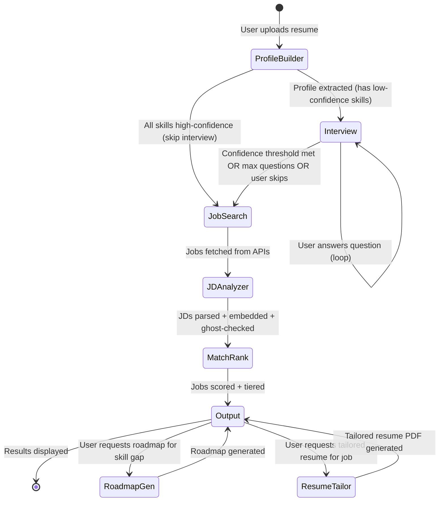

# SAMAS — Multi-Agent AI Job Intelligence System

## The Vision

SAMAS is a **multi-agent AI system** that acts as a brutally honest career advisor. Unlike existing tools that blindly trust self-reported resumes and do keyword matching, SAMAS:

1. **Interrogates** the user through a structured conversational loop to build a proof-scored skill profile
2. **Searches** across multiple job platforms with semantic depth — not just titles, but full JD analysis
3. **Matches** jobs using embedding-based similarity against verified skills
4. **Classifies** jobs into 3 tiers: Easy Gets, Best Matches, and Stretch Goals
5. **Detects** ghost jobs and scams before the user wastes time applying
6. **Generates** tailored resumes per job and skill gap roadmaps on demand

---

## What You'll Learn (The CV Gold)

This project is deliberately designed to teach you production-grade AI engineering. Here's the concept map:

| Concept | Where You'll Learn It |
|---|---|
| **LangGraph StateGraph** | Core orchestration — every agent is a graph node |
| **Human-in-the-Loop (HITL)** | Interview Agent pauses graph, waits for user input, resumes |
| **Cross-Session Persistent Memory** | PostgreSQL checkpointing — user can close browser, come back next day |
| **Streaming (SSE/WebSocket)** | Real-time token streaming from agents to React frontend |
| **Production RAG** | Hybrid BM25 + vector search for JD↔Profile matching |
| **Multi-Agent Orchestration** | Supervisor pattern routing between 6 specialized agents |
| **Tool Use in Agents** | Agents calling APIs (SerpAPI, GitHub, Adzuna) as LangGraph tool nodes |
| **Prompt Engineering** | Structured extraction, scoring rubrics, few-shot evaluation |
| **Cost Management** | LiteLLM proxy for model routing + token tracking |
| **Evaluation & Testing** | LangSmith tracing for agent trajectories + pytest |
| **Async Background Jobs** | Celery/Redis for JD deep-parsing while user continues chatting |
| **Vector Databases** | ChromaDB for embedding JDs and user profiles |
| **API Design** | FastAPI with proper REST + SSE endpoints |

---

## System Architecture

```mermaid
graph TB
    subgraph "Frontend — React + Vite"
        UI["Chat UI + Dashboard"]
    end

    subgraph "API Layer — FastAPI"
        API["REST + SSE Endpoints"]
        WS["WebSocket Handler"]
    end

    subgraph "Orchestration — LangGraph"
        SUP["🎯 Supervisor Agent"]
        PA["📄 Profile Builder Agent"]
        IA["🎤 Interview Agent"]
        JS["🔍 Job Search Agent"]
        JA["📊 JD Analyzer Agent"]
        MA["⚖️ Matching & Ranking Agent"]
        OA["📋 Output Agent"]
    end

    subgraph "Tool Nodes"
        T1["PDF Parser (pdfplumber)"]
        T2["GitHub API"]
        T3["SerpAPI (Google Jobs)"]
        T4["Adzuna API"]
        T5["Jooble API"]
        T6["Remotive API"]
    end

    subgraph "Data Layer"
        PG["PostgreSQL (Checkpoints + User Data)"]
        CH["ChromaDB (JD + Profile Embeddings)"]
        RD["Redis (Session Cache + Task Queue)"]
    end

    subgraph "Infrastructure"
        LL["LiteLLM Proxy (Cost Management)"]
        LS["LangSmith (Tracing)"]
    end

    UI --> API
    UI --> WS
    API --> SUP
    WS --> SUP
    SUP --> PA
    SUP --> IA
    SUP --> JS
    SUP --> JA
    SUP --> MA
    SUP --> OA
    PA --> T1
    PA --> T2
    JS --> T3
    JS --> T4
    JS --> T5
    JS --> T6
    JA --> CH
    MA --> CH
    SUP --> PG
    SUP --> LL
    LL --> LS
```



---

## Agent Architecture (Deep Dive)

### Agent 1: Profile Builder Agent

**What it does:** Extracts structured information from the user's resume PDF and any linked profiles.

**What you'll learn:**
- PDF text extraction with `pdfplumber` (handling tables, columns, bad formatting)
- LLM-based structured data extraction using Pydantic output schemas
- GitHub API integration (commits, languages, contribution patterns)
- Designing a formal schema for skill representation

**How it works:**
1. User uploads resume PDF → `pdfplumber` extracts raw text
2. LLM call with structured output → extracts into `UserProfile` Pydantic schema
3. If GitHub URL found → calls GitHub API to get language distribution, commit frequency, repo quality
4. Outputs a structured profile with initial proof scores (0.0-1.0 scale)

**Proof Score Model:**
```
proof_score = weighted_average(
    resume_mention    × 0.2,  # Mentioned in resume (baseline)
    experience_years  × 0.2,  # Years of stated experience
    project_evidence  × 0.25, # Mentioned in project descriptions
    github_evidence   × 0.2,  # Found in GitHub repos
    certification     × 0.15  # Has relevant certification
)
```

> [!IMPORTANT]
> The proof score is a **heuristic**, not ground truth. Document this honestly. GitHub commits prove volume, not quality. Certifications prove exam-passing, not mastery. This intellectual honesty is what makes the feature CV-worthy.

---

### Agent 2: Interview Agent (Human-in-the-Loop)

**What it does:** Conducts a targeted skill verification conversation to strengthen weak proof scores.

**What you'll learn:**
- LangGraph's `interrupt()` mechanism for HITL
- Conditional edge routing based on confidence thresholds
- Conversation state management across turns
- Prompt engineering for structured questioning

**How it works:**
1. Reviews the profile from Agent 1
2. Identifies skills with proof_score < 0.5 (low confidence)
3. Generates 3-7 targeted questions (not open-ended interrogation)
4. Each answer updates the proof score for that skill
5. Loop continues until all key skills exceed confidence threshold OR max 7 questions reached
6. User can skip at any time → proceeds with current scores

**Example Question Flow:**
```
Agent: "Your resume mentions React, but I don't see React projects on your
       GitHub. Can you describe a React project you've built and what state
       management approach you used?"

User:  "I built a dashboard using React + Zustand for a college project..."

Agent: [Updates React proof_score from 0.3 → 0.6 based on technical depth]
Agent: "Got it. You mention Python — have you worked with any async frameworks
       like FastAPI or used Python for data pipelines?"
```

> [!TIP]
> **UX Critical:** Cap at 7 questions max. Show a progress bar ("3/7 questions"). Let user skip. If you interrogate too long, users drop off. The skip mechanism is essential.

---

### Agent 3: Job Search Agent

**What it does:** Queries multiple job APIs with intelligently generated search variants.

**What you'll learn:**
- Multi-source API integration and normalization
- Query generation from structured profiles (not just job title search)
- Rate limiting and retry strategies
- Data deduplication across sources

**The Job Data Strategy (India-Focused):**

| Source | Coverage | Cost | What It Gets You |
|---|---|---|---|
| **SerpAPI (Google Jobs)** | Aggregates LinkedIn, Naukri, Indeed via Google | ~$25/mo, 100 free searches | Best single source — Google indexes most Indian job boards |
| **Adzuna API** | India + 19 other countries | Free tier: 2,500 hits/month | Salary data, location, category tags |
| **Jooble API** | India-supported, free | Free with API key | Good volume, simple integration |
| **Remotive API** | Remote jobs globally | Free, max 4 req/day | Remote tech jobs |
| **Himalayas API** | Remote jobs | Free, no API key needed | Salary, timezone, seniority data |
| **JobSpy (Open Source)** | LinkedIn, Indeed, Glassdoor scraping | Free (OSS library) | Backup/supplementary, use carefully |

> [!WARNING]
> **Do NOT scrape LinkedIn/Naukri directly.** LinkedIn actively litigates. Naukri uses Akamai anti-bot. Use API aggregators (SerpAPI/Adzuna/Jooble) that index these platforms legitimately. JobSpy is a backup for development/testing only.

**Query Generation Strategy:**
Instead of searching just "Frontend Developer", the agent generates 3-5 query variants:
```python
# From profile: {primary_role: "Frontend Developer", skills: ["React", "TypeScript", "Next.js"]}
queries = [
    "Frontend Developer React",
    "React Developer",
    "UI Engineer TypeScript",
    "Full Stack Developer Next.js",
    "Software Engineer Frontend"
]
# Each query goes to each API → normalized → deduplicated
```

**Normalization Schema:**
All jobs from all sources get normalized into a unified `JobListing` schema:
```python
class JobListing(BaseModel):
    id: str                    # Internal unique ID
    source: str                # "serpapi" | "adzuna" | "jooble" | etc.
    title: str
    company: str
    location: str
    salary_min: Optional[float]
    salary_max: Optional[float]
    salary_is_predicted: bool
    description: str           # Full JD text
    posting_date: datetime
    url: str                   # Apply link
    employment_type: str       # full_time, contract, etc.
    raw_data: dict             # Original API response preserved
```

---

### Agent 4: JD Analyzer Agent

**What it does:** Deep-parses each job description to extract structured requirements and embeds them for matching.

**What you'll learn:**
- LLM-based information extraction from unstructured text
- Text embedding generation (OpenAI `text-embedding-3-small` or `all-MiniLM-L6-v2`)
- ChromaDB vector storage and similarity search
- Hybrid search: BM25 keyword + vector semantic

**How it works:**
1. Takes each `JobListing` from Agent 3
2. LLM extracts structured requirements:
   ```python
   class JDRequirements(BaseModel):
       required_skills: List[SkillRequirement]  # skill + level + is_mandatory
       experience_years_min: int
       experience_years_max: Optional[int]
       education: Optional[str]
       implicit_signals: List[str]  # "startup culture", "fast-paced", etc.
       red_flags: List[str]         # Detected issues
   ```
3. Generates embedding of full JD text → stores in ChromaDB
4. Runs ghost job detection heuristics on each listing

**Ghost Job Detection Signals:**

| Signal | Weight | Logic |
|---|---|---|
| Posting age > 30 days | High | Old listing without repost = likely stale/ghost |
| JD text similarity > 0.92 with other listings from same company | High | Copy-paste recycled JDs |
| Vague requirements ("good communication skills" as only requirement) | Medium | Placeholder listings |
| No salary range + "competitive salary" | Low | Common but suspicious when combined |
| Company has multiple identical roles posted simultaneously | Medium | Pipeline building signal |

Output: Each job gets a `listing_health_score` (0-1) and a `ghost_probability` label.

---

### Agent 5: Matching & Ranking Agent

**What it does:** Scores every job against the user's profile and buckets into 3 tiers.

**What you'll learn:**
- Cosine similarity scoring with embedding vectors
- Multi-dimensional scoring with weighted factors
- Ranking algorithms and tier classification
- The math behind recommendation systems

**Scoring Formula:**
```
match_score = weighted_sum(
    skill_overlap_score     × 0.35,  # % of required skills user has (proof-weighted)
    experience_delta_score  × 0.20,  # How close user's years match requirement
    embedding_similarity    × 0.25,  # Cosine similarity of profile↔JD embeddings
    proof_alignment_score   × 0.20   # Higher proof scores on matching skills = higher
)
```

**3-Tier Classification:**

| Tier | Criteria | What User Sees |
|---|---|---|
| 🟢 **Easy Gets** | match_score > 0.80, user exceeds requirements | "You're overqualified. High chance of callback." |
| 🟡 **Best Matches** | 0.55 < match_score ≤ 0.80 | "Good fit. These align with your verified skills." |
| 🔴 **Stretch Goals** | 0.30 < match_score ≤ 0.55 | "Reach roles. Here's what you're missing: [skills]" |

Jobs with match_score < 0.30 are filtered out entirely. Jobs with ghost_probability > 0.7 get flagged visually.

---

### Agent 6: Output & Roadmap Agent

**What it does:** Generates the final output: job cards, per-job tailored resume suggestions, and on-demand skill gap roadmaps.

**What you'll learn:**
- LLM-based content generation with tight constraints
- PDF generation with `WeasyPrint` or `reportlab`
- On-demand sub-agent invocation (roadmap generation)

**Features:**
1. **Job Cards** — Structured output per job with tier label, match score breakdown, company health signals, ghost badge
2. **Resume Tailoring** — For each shortlisted job, suggests bullet point reordering and keyword additions to maximize ATS score
3. **Skill Gap Roadmap** — On-demand for stretch goals: "You lack Kubernetes. Here's a 4-week roadmap: [structured plan]"

---

## Tech Stack (Final Decision)

| Layer | Technology | Why |
|---|---|---|
| **Backend** | FastAPI (Python 3.11+) | Async-native, perfect for streaming + agent orchestration |
| **Agent Framework** | LangGraph | StateGraph with checkpointing, HITL, conditional edges — exactly what this needs |
| **LLM Gateway** | LiteLLM Proxy | Unified API across OpenAI/Gemini/Claude, token tracking, budget caps |
| **Vector DB** | ChromaDB | Open-source, easy local setup, good for this scale |
| **Relational DB** | PostgreSQL | LangGraph checkpointing + user data + job cache |
| **Cache / Queue** | Redis | Session state + Celery task queue for async JD parsing |
| **Frontend** | React + Vite | SPA with streaming chat UI, job dashboard, profile viewer |
| **PDF Parsing** | pdfplumber | Best Python PDF text extractor for resumes |
| **Embeddings** | `text-embedding-3-small` (OpenAI) or `all-MiniLM-L6-v2` (local) | Cost vs speed tradeoff |
| **Tracing** | LangSmith | Full agent trajectory logging, debugging, evaluation |
| **Deployment** | Docker Compose | All services (FastAPI, Postgres, Redis, ChromaDB, LiteLLM) containerized |

---

## LangGraph State Machine (The Brain)



**Key LangGraph Concepts Used:**
- **StateGraph** — The entire pipeline is one graph with shared state
- **Checkpointing** — PostgresSaver persists state after every node → user can resume anytime
- **interrupt()** — Interview node pauses execution, waits for user input via API
- **Conditional Edges** — Routing based on confidence scores, user choices
- **Send()** — Fan-out JD analysis across multiple jobs in parallel
- **Tool Nodes** — API calls (SerpAPI, GitHub, Adzuna) wrapped as LangGraph tools

---

## Data Flow (End-to-End)

```
User uploads resume.pdf
        │
        â–¼
┌─────────────────────┐
│  Profile Builder     │ → pdfplumber → LLM extraction → GitHub API
│  Output: UserProfile │   {skills: [{name, level, proof_score, evidence[]}]}
└─────────┬───────────┘
          │
          â–¼
┌─────────────────────┐
│  Interview Agent     │ → Asks 3-7 targeted questions
│  Updates: proof_scores│  → Each answer updates scores
│  Uses: interrupt()   │  → User can skip anytime
└─────────┬───────────┘
          │
          â–¼
┌─────────────────────┐
│  Job Search Agent    │ → SerpAPI + Adzuna + Jooble + Remotive
│  Output: JobListing[]│   → Generates 3-5 query variants per profile
│  Normalized + Deduped│   → ~50-200 unique jobs
└─────────┬───────────┘
          │
          â–¼
┌─────────────────────┐
│  JD Analyzer Agent   │ → LLM extracts requirements from each JD
│  Output:             │   → Generates embeddings → ChromaDB
│  - JDRequirements[]  │   → Ghost job detection heuristics
│  - Embeddings stored │   → Listing health scores
└─────────┬───────────┘
          │
          â–¼
┌─────────────────────┐
│  Matching Agent      │ → Cosine similarity + multi-factor scoring
│  Output:             │   → 3-tier classification
│  - Scored job list   │   → Skill gap identification per job
│  - 3 tiers           │
└─────────┬───────────┘
          │
          â–¼
┌─────────────────────┐
│  Output Agent        │ → Job cards with scores, badges, company intel
│  + Resume Tailor     │   → Per-job resume suggestions (on-demand)
│  + Roadmap Gen       │   → Skill gap roadmaps (on-demand)
└─────────────────────┘
```

---

## Project Structure

```
True Job/
├── backend/
│   ├── app/
│   │   ├── main.py              # FastAPI app entry point
│   │   ├── config.py            # Settings, env vars, API keys
│   │   ├── api/
│   │   │   ├── routes/
│   │   │   │   ├── chat.py      # SSE streaming chat endpoint
│   │   │   │   ├── profile.py   # Upload resume, get profile
│   │   │   │   ├── jobs.py      # Job results, tailored resume, roadmap
│   │   │   │   └── health.py    # Health check
│   │   │   └── deps.py          # Dependency injection
│   │   ├── agents/
│   │   │   ├── graph.py         # Main LangGraph StateGraph definition
│   │   │   ├── state.py         # Shared state schema (TypedDict)
│   │   │   ├── supervisor.py    # Supervisor node logic
│   │   │   ├── profile_builder.py
│   │   │   ├── interviewer.py   # HITL interview loop
│   │   │   ├── job_searcher.py
│   │   │   ├── jd_analyzer.py
│   │   │   ├── matcher.py
│   │   │   └── output_agent.py
│   │   ├── tools/
│   │   │   ├── pdf_parser.py    # pdfplumber wrapper
│   │   │   ├── github_api.py    # GitHub profile analysis
│   │   │   ├── serpapi.py       # SerpAPI Google Jobs
│   │   │   ├── adzuna.py        # Adzuna API client
│   │   │   ├── jooble.py        # Jooble API client
│   │   │   ├── remotive.py      # Remotive API client
│   │   │   └── himalayas.py     # Himalayas API client
│   │   ├── models/
│   │   │   ├── user_profile.py  # Pydantic schemas for profile
│   │   │   ├── job_listing.py   # Normalized job schema
│   │   │   ├── jd_requirements.py
│   │   │   └── matching.py      # Scoring models
│   │   ├── services/
│   │   │   ├── embedding.py     # Embedding generation + ChromaDB
│   │   │   ├── ghost_detector.py # Ghost job detection logic
│   │   │   ├── resume_tailor.py # Per-job resume tailoring
│   │   │   └── roadmap_gen.py   # Skill gap roadmap generation
│   │   └── db/
│   │       ├── postgres.py      # PostgreSQL connection + checkpointer
│   │       └── redis_client.py  # Redis session + cache
│   ├── tests/
│   │   ├── test_profile_builder.py
│   │   ├── test_interview.py
│   │   ├── test_job_search.py
│   │   ├── test_matching.py
│   │   └── test_ghost_detector.py
│   ├── requirements.txt
│   ├── Dockerfile
│   └── .env.example
├── frontend/
│   ├── src/
│   │   ├── App.jsx
│   │   ├── components/
│   │   │   ├── ChatPanel/       # Streaming chat with agent
│   │   │   ├── ProfileCard/     # Visual skill profile with proof scores
│   │   │   ├── JobCard/         # Individual job with tier badge
│   │   │   ├── JobBoard/        # 3-column tier view
│   │   │   ├── RoadmapView/     # Skill gap roadmap display
│   │   │   └── ResumeUpload/    # PDF upload + drag-drop
│   │   ├── hooks/
│   │   │   ├── useSSE.js        # Server-Sent Events hook
│   │   │   └── useChat.js       # Chat state management
│   │   └── services/
│   │       └── api.js           # API client
│   ├── package.json
│   └── vite.config.js
├── docker-compose.yml           # All services
├── litellm_config.yaml          # LLM routing + budgets
└── README.md
```

---

## Build Phases

### Phase 1: Foundation (Week 1)
> **Goal:** Resume → Structured Profile with proof scores

- [ ] Set up project structure (FastAPI + React + Docker Compose)
- [ ] Implement PDF parser tool (`pdfplumber`)
- [ ] Build `UserProfile` Pydantic schema with proof score model
- [ ] Build Profile Builder agent (LangGraph node)
- [ ] Implement GitHub API tool for skill evidence
- [ ] Set up PostgreSQL + LangGraph checkpointing
- [ ] Build basic chat UI with SSE streaming
- [ ] **Test:** Upload resume → get structured profile with scores

### Phase 2: Interview Loop (Week 2)
> **Goal:** HITL interview agent that strengthens proof scores

- [ ] Implement Interview Agent with `interrupt()` pattern
- [ ] Build conditional routing (skip if all scores > threshold)
- [ ] Design question generation prompts (targeted, not generic)
- [ ] Implement proof score update logic based on answers
- [ ] Add skip mechanism + progress indicator
- [ ] Connect chat UI to interview flow with streaming
- [ ] **Test:** Full flow — upload resume → interview → finalized profile

### Phase 3: Job Search Pipeline (Week 3)
> **Goal:** Multi-source job search with normalization

- [ ] Implement SerpAPI Google Jobs tool (primary source)
- [ ] Implement Adzuna API tool
- [ ] Implement Jooble API tool
- [ ] Implement Remotive + Himalayas API tools
- [ ] Build query generation logic (profile → multiple search queries)
- [ ] Implement job normalization and deduplication
- [ ] Build Job Search Agent (LangGraph node)
- [ ] **Test:** Profile → 50-200 normalized, deduplicated jobs

### Phase 4: JD Analysis + Matching (Week 4)
> **Goal:** Semantic JD analysis, embedding, matching, 3-tier output

- [ ] Implement JD Analyzer Agent (LLM-based requirements extraction)
- [ ] Set up ChromaDB + embedding generation
- [ ] Implement ghost job detection heuristics
- [ ] Build Matching Agent with multi-factor scoring
- [ ] Implement 3-tier classification logic
- [ ] Build Output Agent with job cards
- [ ] Build job board UI (3-column tier view)
- [ ] **Test:** End-to-end: resume → interview → jobs → tiered results

### Phase 5: Advanced Features (Week 5)
> **Goal:** Resume tailoring, roadmaps, ghost badges, polish

- [ ] Implement per-job resume tailoring engine
- [ ] Implement on-demand skill gap roadmap generation
- [ ] Add ghost job badges + listing health scores to UI
- [ ] Implement salary intelligence (from Adzuna salary data)
- [ ] Add company intelligence cards (if API budget allows)
- [ ] Set up LiteLLM proxy for cost management
- [ ] Set up LangSmith tracing
- [ ] Polish UI — dark mode, animations, mobile responsive
- [ ] Write comprehensive README + proof score methodology doc
- [ ] **Test:** Full system test with real resumes

---

## User Review Required

> [!IMPORTANT]
> **LLM Provider Choice:** This plan assumes OpenAI API for main LLM calls and embeddings. Gemini (free tier) is a viable alternative for development. Which LLM provider(s) do you want to use? This affects cost and model routing strategy.

> [!IMPORTANT]
> **Budget Reality:** SerpAPI ($25/mo for 5,000 searches), OpenAI API (~$5-20/mo depending on usage), LangSmith (free tier available). Total estimated cost: **₹3,000-5,000/month** during development. Are you comfortable with this?

> [!WARNING]
> **Scope vs. Time:** This plan is 5 weeks for a focused developer. If you're doing this alongside coursework/other projects, budget 7-8 weeks. Phase 1-4 is the MVP. Phase 5 is the differentiator. Don't skip Phase 5's resume tailoring and ghost detection — that's what makes this CV-worthy.

## Open Questions

> [!IMPORTANT]
> 1. **LLM Provider:** OpenAI API, Google Gemini (free tier for dev), or both via LiteLLM routing?
> 2. **Hosting Plan:** Local development only, or do you want to deploy (Railway, Render, etc.)?
> 3. **India-Specific Scope:** Starting with tech jobs in India (Bangalore, Mumbai, Hyderabad, Delhi, Pune, Chennai, remote). Correct?
> 4. **Authentication:** Do you want user accounts (login/signup) or is this a single-user tool for now?
> 5. **Name Confirmation:** "SAMAS" — the workspace is "True Job". Happy with this name?

## Verification Plan

### Automated Tests
```bash
# Unit tests for each agent
pytest backend/tests/ -v

# Integration test: full pipeline
pytest backend/tests/test_integration.py -v

# LangSmith evaluation traces
# Run evaluation dataset through pipeline, check trajectory quality
```

### Manual Verification
- Upload 3-5 real resumes with varying experience levels
- Verify proof scores make sense (junior vs senior profiles)
- Check job results against manual Google Jobs search
- Validate ghost detection on known stale listings
- Test cross-session persistence (upload → close → reopen → resume)
- Verify SSE streaming works smoothly in the UI
